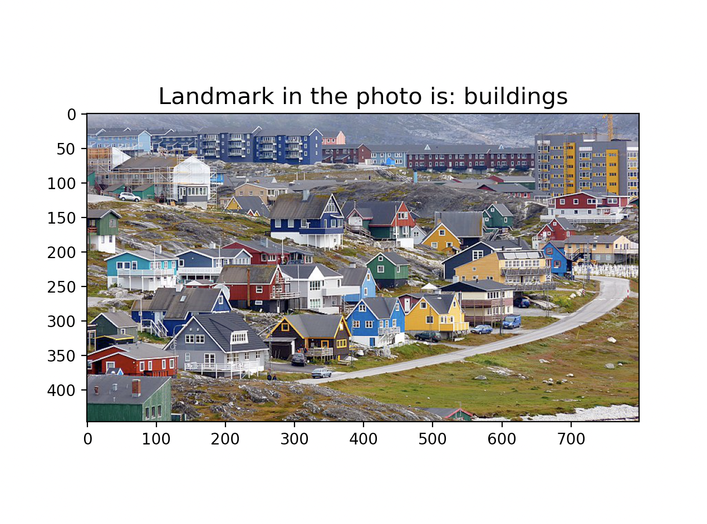

# CNN-Image-classification
This project creates a Convolutional Neural Network on PyTorch to classify images.

To run this project, you need the following packages:

--------------------------------------------------------------------------------
LIBRARY		|    VERSION	|  ANACONDA INSTALLATION 
----------------|---------------|-----------------------------------------------
Python 		|     3.8	|         	
matplotlib 	|    3.5.1	|  conda install -c conda-forge matplotlib 	
torch 		|    1.11.0	|  conda install -c pytorch pytorch 
torchvision	|    0.12.0	|  conda install -c conda-forge torchvision
sklearn		|    1.0.2	|  conda install -c anaconda scikit-learn
-------------------------------------------------------------------------------

## The files in the project:
model.py -> The file has Convolutional Neural Network architecture used in the project
train.py -> The training loop used to train the model and save the model
data_loader.py -> The file has data loader function that converts images to the size of input in Convolutional Neural Network
test2.py -> The file contains tester that can get a new image as input and predict it's landmark class
saved_final_model -> The saved model that is used in predicting

## Data:

This Data contains around 25k images of size 150x150 distributed under 6 categories.
{'buildings' -> 0,
'forest' -> 1,
'glacier' -> 2,
'mountain' -> 3,
'sea' -> 4,
'street' -> 5 }

The Train, Test and Prediction data is separated in each zip files. There are around 14k images in Train, 3k in Test and 7k in Prediction.
This data was initially published on https://datahack.analyticsvidhya.com by Intel to host a Image classification Challenge.

## Acknowledgements
Thanks to https://datahack.analyticsvidhya.com for the challenge and Intel for the Data

## How to run the predictions:

In order to run the predictions, open the terminal, go to the directory of the project. Then, run ```python test2.py path_to_image``` and you will have a prediction from the model. 

## How the model looks:



The model is able to classify buildings of Greenland.

## Conclusions and future plans:

We want to work on the model and improve it by changing the model architecture. The current version of the model is predicting unseen input data with high accuracy, but there could be small errors in complex images. 

The team also wants to work on a web application that can take images as inputs and predict the class in the future. 
